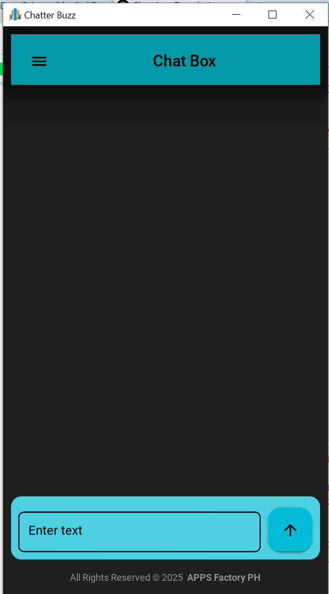

# chat_app
A lightweight and intuitive chat application built using Python and KivyMD. Designed for seamless communication with a modern UI. 

# Simple Chat App (Demo)  

A basic chat application built using Python and KivyMD. This is a demo program showcasing the UI and basic functionality.  

## Screenshot  
  

## Features  
- Modern UI with KivyMD  
- Basic chat interface
-  
## Versions
Python Version: 3.8.9 (tags/v3.8.9:a743f81, Apr 6 2021, 14:02:34) [MSC v.1928 64 bit (AMD64)]
Kivy Version: 2.3.1
KivyMD Version: 1.2.0

## Installation  
```bash
pip install kivy kivymd
python chat_app.py
```

## Created By  
  

